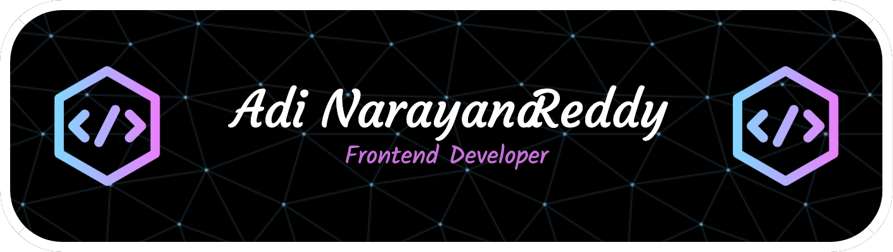

<h1 align="center">Hi !, This is Adi Narayana Reddy</h1>

Front End Developer (React JS)

------------------------------

A passionate front end developer with a focus on building beautiful and intuitive web applications. Constantly exploring new ways to push the limits of what is possible in web development and also always looking for new opportunities to grow as a developer . if looking for a dedicated and skilled React Developer , i would love to hear from you.

* 🖥️  See my portfolio at [adiweb.dev](http://adiwebdev.netlify.app)
* ✉️  You can contact me at [adinarayana4444@gmail.com](mailto:adinarayana4444@gmail.com)
* 🤝  I'm open to collaborating on Front end projects on React JS

<h3 align="center">Skills</h3>

### 
Socials

   

### 
Badges

  &nbsp;  

<b>My GitHub Stats</b>

